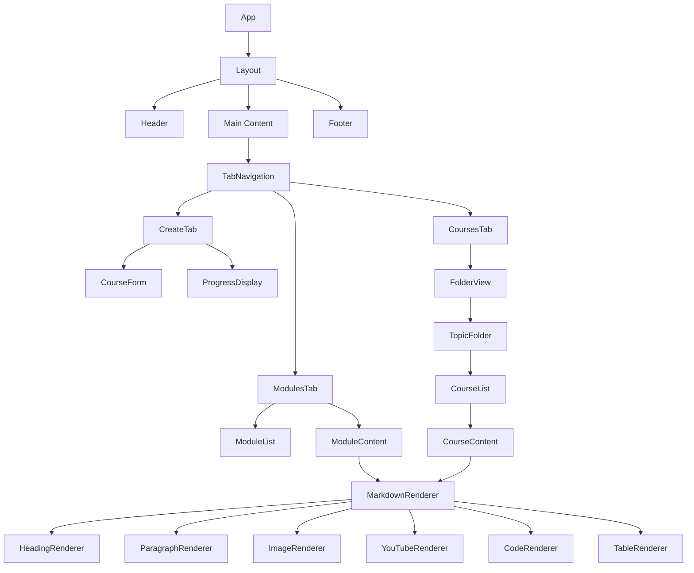
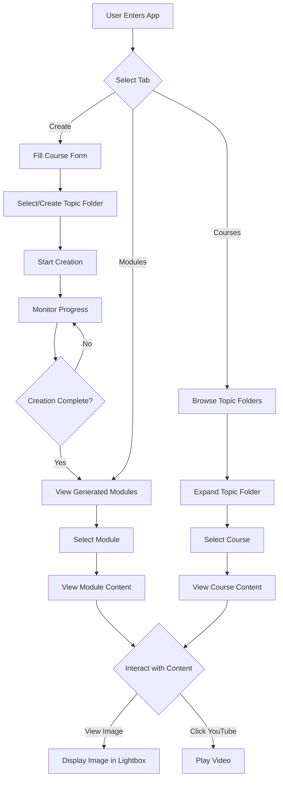
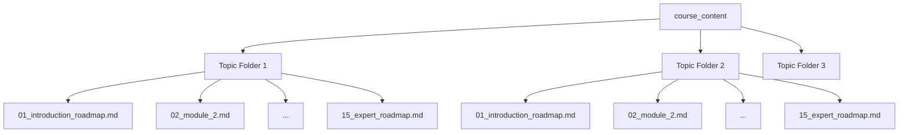
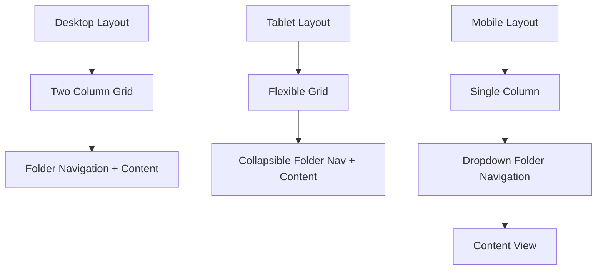

# Design Document

## Overview

This design document outlines the approach for upgrading the course creator UI to a modern interface using Shadcn UI components, improving the markdown rendering capabilities, and organizing courses by topic in folders. The design focuses on creating a visually appealing, accessible, and responsive user interface while enhancing the content display features and improving content organization.

## Architecture

The application will continue to use the Next.js framework with React, but will incorporate the following new libraries:

1. **Shadcn UI** - A collection of reusable components built using Radix UI and Tailwind CSS
2. **React Markdown** - For rendering markdown content with proper formatting
3. **Rehype/Remark plugins** - For extending markdown capabilities with syntax highlighting and other features
4. **React-YouTube** - For embedding YouTube videos with thumbnails
5. **Lucide React** - For modern icons including folder and file icons

The architecture will follow a component-based approach with:
- Layout components for page structure
- UI components from Shadcn for interactive elements
- Custom components for specialized rendering (markdown, YouTube embeds)
- Utility functions for content processing
- Backend modifications for folder-based course organization

## Components and Interfaces

### Core UI Components (from Shadcn)

1. **Button**
   - Primary, secondary, outline, and ghost variants
   - Loading states for async operations
   - Icon support

2. **Card**
   - For displaying course modules and content
   - With header, content, and footer sections
   - Hover and focus states

3. **Tabs**
   - For navigation between create, modules, and courses sections
   - With animated indicators and responsive behavior

4. **Input and Form Components**
   - Text inputs with validation states
   - Number inputs with increment/decrement controls
   - Form layout components

5. **Dialog**
   - For modal interactions like image previews
   - With overlay, animations, and accessibility features

6. **Progress**
   - For displaying course creation progress
   - With color variants for different stages

7. **Collapsible**
   - For expandable/collapsible folder view
   - With animation and accessibility support

### Custom Components

1. **MarkdownRenderer**
   - Renders markdown content with proper formatting
   - Handles headings, paragraphs, lists, code blocks, and tables
   - Integrates with image and YouTube rendering

2. **ImageRenderer**
   - Handles responsive image display
   - Provides loading states and error handling
   - Supports lightbox functionality for enlarged viewing

3. **YouTubeEmbed**
   - Extracts video IDs from YouTube URLs
   - Fetches and displays thumbnails
   - Provides play functionality with options for inline or new tab

4. **ProgressLog**
   - Displays creation progress messages
   - Auto-scrolls to latest updates
   - Color-codes different stages

5. **FolderView**
   - Displays courses organized by topic folders
   - Supports expanding/collapsing folders
   - Shows file icons and metadata

## Data Models

The existing data models will be enhanced to support folder organization:

```typescript
interface CourseModule {
  filename: string;
  title: string;
  content: string;
  module_number: number;
  enhanced?: boolean;
  created_at?: number;
  topic_folder?: string; // New field for folder organization
  // New fields for improved content rendering
  parsed_content?: ParsedContent;
}

interface TopicFolder {
  name: string;
  display_name: string;
  created_at: number;
  courses: CourseModule[];
}

interface ParsedContent {
  sections: Section[];
  media: {
    images: ImageMeta[];
    videos: VideoMeta[];
  };
}

interface Section {
  type: 'heading' | 'paragraph' | 'list' | 'code' | 'table';
  content: string;
  level?: number; // For headings
  language?: string; // For code blocks
}

interface ImageMeta {
  src: string;
  alt: string;
  caption?: string;
}

interface VideoMeta {
  platform: 'youtube';
  videoId: string;
  title?: string;
  timestamp?: string;
}
```

## Backend Changes

The backend will need modifications to support folder-based organization:

1. **File System Structure**
   - Create a folder structure in the course_content directory
   - Store course files in topic-specific subfolders
   - Maintain backward compatibility for existing files

2. **API Modifications**
   - Update the course creation endpoint to accept and use topic folders
   - Enhance the course listing endpoint to return folder structure
   - Add endpoints for folder management (if needed)

3. **Course Creation System**
   - Modify the EnhancedCourseCreationSystem to save files in topic folders
   - Update file paths and references throughout the system

## Error Handling

1. **Image Loading Errors**
   - Fallback UI for failed image loads
   - Retry mechanisms for transient failures
   - Error logging for persistent issues

2. **YouTube Embedding Errors**
   - Fallback to link display when embedding fails
   - Error boundaries to prevent component crashes
   - User feedback for unavailable videos

3. **Markdown Parsing Errors**
   - Graceful degradation to plain text when parsing fails
   - Specific error handling for different markdown elements
   - Sanitization to prevent XSS vulnerabilities

4. **Folder Access Errors**
   - Graceful handling of missing folders
   - Creation of folders when needed
   - Fallback to flat view when folder structure is unavailable

## Testing Strategy

1. **Component Testing**
   - Unit tests for individual UI components
   - Snapshot tests for visual regression
   - Accessibility tests using jest-axe

2. **Integration Testing**
   - Testing markdown rendering with various content types
   - Testing YouTube embedding with different URL formats
   - Testing responsive behavior across breakpoints
   - Testing folder navigation and expansion/collapse

3. **User Experience Testing**
   - Keyboard navigation testing
   - Screen reader compatibility testing
   - Color contrast and readability testing
   - Folder interaction testing

## UI Design

### Color Palette

The application will use a refined color palette based on the existing design but with improved contrast and visual hierarchy:

- Primary: `#3b82f6` (blue-500)
- Secondary: `#6366f1` (indigo-500)
- Accent: `#8b5cf6` (violet-500)
- Background: `#f9fafb` (gray-50)
- Surface: `#ffffff` (white)
- Text: `#1f2937` (gray-800)
- Muted Text: `#6b7280` (gray-500)
- Border: `#e5e7eb` (gray-200)
- Success: `#10b981` (emerald-500)
- Warning: `#f59e0b` (amber-500)
- Error: `#ef4444` (red-500)

### Typography

The application will use a modern typography system:

- Headings: Inter, sans-serif
- Body: Inter, sans-serif
- Code: JetBrains Mono, monospace

Font sizes will follow a typographic scale:
- xs: 0.75rem
- sm: 0.875rem
- base: 1rem
- lg: 1.125rem
- xl: 1.25rem
- 2xl: 1.5rem
- 3xl: 1.875rem
- 4xl: 2.25rem

### Layout

The application will use a responsive grid layout:
- Mobile: Single column
- Tablet: Two columns (1/3 + 2/3)
- Desktop: Two columns (1/2 + 1/2)

Spacing will follow a consistent scale:
- xs: 0.25rem
- sm: 0.5rem
- md: 1rem
- lg: 1.5rem
- xl: 2rem
- 2xl: 3rem

## Markdown Rendering

The markdown rendering will be enhanced to properly handle:

1. **Headings**
   - H1: Large, bold, with bottom border
   - H2: Medium, bold, with bottom margin
   - H3: Small, semi-bold

2. **Text Formatting**
   - Bold: Strong emphasis
   - Italic: Subtle emphasis
   - Strikethrough: For deleted content
   - Links: With hover states and external indicators

3. **Lists**
   - Unordered: With custom bullets
   - Ordered: With proper numbering
   - Nested: With appropriate indentation

4. **Code**
   - Inline: With monospace font and background
   - Blocks: With syntax highlighting and copy button

5. **Tables**
   - Responsive design with horizontal scrolling on mobile
   - Styled headers and alternating row colors

6. **Images**
   - Responsive sizing with max-width constraints
   - Lazy loading for performance
   - Optional lightbox for enlarged viewing

7. **YouTube Videos**
   - Thumbnail preview with play button overlay
   - Responsive iframe embedding
   - Title and description display

## YouTube Integration

YouTube links will be transformed into embedded players with thumbnails:

1. **Link Detection**
   - Regex pattern matching for various YouTube URL formats
   - Extraction of video ID from URLs

2. **Thumbnail Display**
   - Fetching thumbnail from YouTube API
   - Displaying thumbnail with play button overlay
   - Handling loading and error states

3. **Playback Options**
   - Inline playback within the course content
   - Option to open in new tab
   - Accessibility considerations for keyboard users

## Folder Organization

The folder organization will be implemented as follows:

1. **Backend Implementation**
   - Create physical folders in the course_content directory
   - Move existing files to appropriate folders based on topic
   - Update file paths in the database or API responses

2. **Frontend Implementation**
   - Display courses grouped by topic folders
   - Show folder icons and expand/collapse controls
   - Maintain selected state when navigating within folders

3. **User Interaction**
   - Click to expand/collapse folders
   - Visual indication of current folder and selected file
   - Breadcrumb navigation for folder context

4. **Course Creation Flow**
   - Add topic folder selection/creation during course creation
   - Automatically organize new course files in the selected folder
   - Show folder context during course creation progress

## Responsive Design

The application will be fully responsive with breakpoints at:
- Mobile: < 640px
- Tablet: 640px - 1024px
- Desktop: > 1024px

Key responsive features:
- Fluid typography that scales with viewport
- Stack layout on mobile, grid on larger screens
- Collapsible navigation on smaller screens
- Touch-friendly targets on mobile devices
- Folder view adapts to screen size

## Accessibility Considerations

The design will prioritize accessibility with:
- ARIA attributes for interactive elements
- Keyboard navigation support
- Focus management for modals and dialogs
- Sufficient color contrast (WCAG AA compliance)
- Screen reader announcements for dynamic content
- Alternative text for images and media
- Proper ARIA roles for folder structure

## Implementation Approach

The implementation will follow a phased approach:

1. **Setup Phase**
   - Install and configure Shadcn UI and dependencies
   - Set up theming and global styles

2. **Backend Modifications Phase**
   - Implement folder structure in the backend
   - Update API endpoints to support folders
   - Migrate existing content to folder structure

3. **Component Migration Phase**
   - Replace existing UI components with Shadcn equivalents
   - Implement responsive layouts
   - Create folder view component

4. **Content Rendering Phase**
   - Implement enhanced markdown rendering
   - Add image display improvements
   - Integrate YouTube embedding

5. **Refinement Phase**
   - Optimize performance
   - Enhance accessibility
   - Polish animations and transitions

## Design Diagrams

### Component Hierarchy



### User Flow



### Folder Structure



### Responsive Layout

